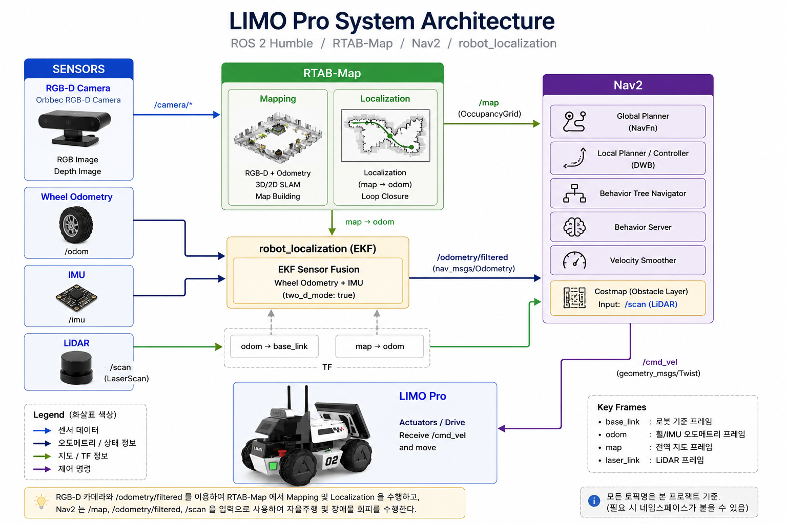
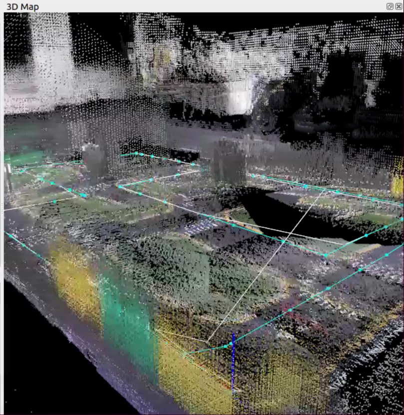
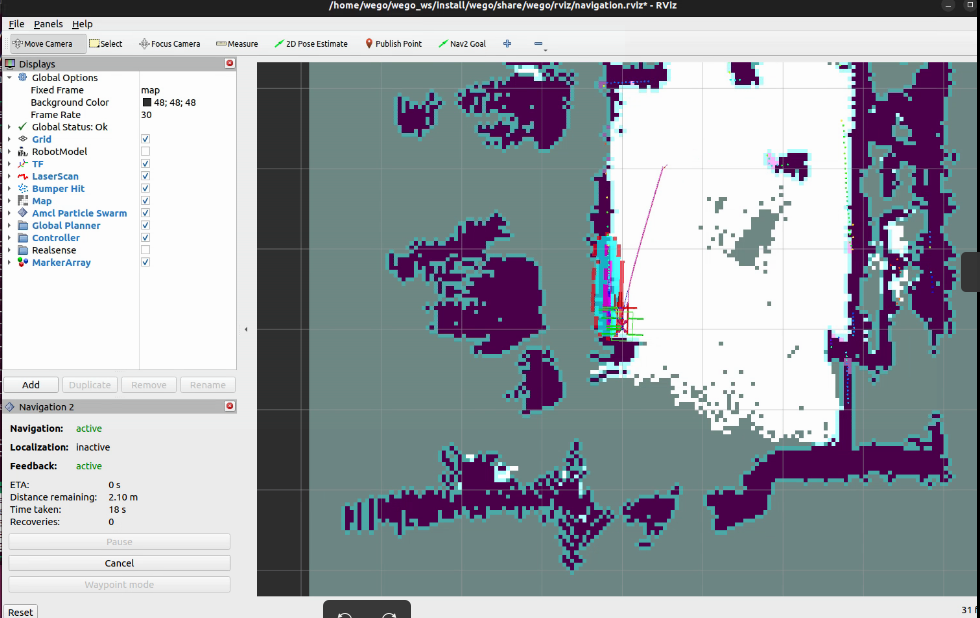

# LIMO Pro Autonomous Navigation & Sensor Fusion

> ROS 2 기반 RGB-D SLAM, Localization 및 자율주행 시스템 구축과  
> Wheel Odometry / Wheel+IMU EKF Sensor Fusion 비교 실험

## Project Overview

본 프로젝트에서는 LIMO Pro 모바일 로봇을 이용하여 ROS 2 기반 실내 자율주행 시스템을 구축하고,
센서융합 방식에 따른 자율주행 성능 차이를 실험적으로 비교하였다.

Orbbec RGB-D Camera와 RTAB-Map을 이용하여 실내 지도를 생성하고,
생성된 지도를 기반으로 Localization 및 Nav2 자율주행 환경을 구성하였다.

이후 위치추정 방식을 다음 두 조건으로 분리하였다.

- Wheel Odometry only
- Wheel Odometry + IMU → EKF Sensor Fusion

동일한 지도와 Nav2 설정을 유지한 상태에서 반복 자율주행 실험을 수행하고,
주행 성공률, Navigation Time, Recovery 횟수, 경로 오차,
최종 위치 및 자세 오차 등을 분석하였다.

## Tech Stack

| Category | Technology |
|---|---|
| Robot | LIMO Pro |
| OS | Ubuntu 22.04.5 LTS |
| Middleware | ROS 2 Humble |
| RGB-D Camera | Orbbec RGB-D Camera |
| SLAM | RTAB-Map |
| Localization | RTAB-Map Localization |
| Navigation | Nav2 |
| Sensor Fusion | robot_localization EKF |
| Sensors | Wheel Odometry, IMU, RGB-D Camera, LiDAR |
| Data Logging | rosbag2 |
| Analysis | Python |

## System Architecture

  

Wheel Odometry와 IMU를 EKF로 융합하여 `/odometry/filtered`를 생성하고,
RGB-D Camera와 융합 Odometry를 RTAB-Map의 입력으로 사용하여 Mapping 및 Localization 환경을 구성하였다.
Nav2는 생성된 지도와 위치추정 정보, LiDAR `/scan` 기반 장애물 정보를 이용하여 경로 계획 및 자율주행을 수행한다.

## Implementation

### 1. Sensor & TF Configuration

LIMO Pro에 탑재된 RGB-D Camera, Wheel Odometry, IMU 및 LiDAR의 ROS 2 토픽을 확인하고,
각 센서 데이터의 발행 주기와 좌표계(Frame)를 분석하였다.

주요 센서 토픽은 다음과 같다.

| Sensor | ROS 2 Topic | Description |
|---|---|---|
| RGB Camera | `/camera/color/image_raw` | RGB Image |
| Depth Camera | `/camera/depth/image_raw` | Depth Image |
| Wheel Odometry | `/odom` | Wheel Odometry |
| IMU | `/imu/data` | Orientation / Angular Velocity / Acceleration |
| Fused Odometry | `/odometry/filtered` | EKF-based Odometry |
| LiDAR | `/scan` | 2D LaserScan |

RGB-D Camera의 Depth 데이터를 Color Camera 좌표계에 정렬하고,
`base_link`를 기준으로 카메라의 실제 장착 위치와 각도를 반영하도록 TF를 구성하였다.

  

  <em>RGB-D Camera와 Odometry를 이용한 RTAB-Map 기반 3D Mapping 결과</em>

### 3. Localization & Nav2 Autonomous Navigation

Mapping을 통해 생성한 지도를 기반으로 RTAB-Map을 Localization mode로 실행하고,
Nav2와 연동하여 실내 자율주행 환경을 구성하였다.

RTAB-Map은 RGB-D Camera 데이터와 Odometry를 이용하여 지도 상에서 로봇의 위치를 추정하며,
Nav2는 현재 위치와 사용자가 지정한 Goal Pose를 기반으로 Global Path와 Local Path를 생성한다.

주행 중에는 LiDAR `/scan` 데이터를 Nav2 Costmap의 Obstacle Layer에 입력하여
주변 장애물을 반영하도록 구성하였다.

이를 통해 동일한 지도와 Navigation 설정을 유지한 상태에서
위치추정 방식에 따른 자율주행 성능을 비교할 수 있는 실험 환경을 구축하였다.

  

  <em>RTAB-Map Localization과 Nav2를 연동한 실내 자율주행</em>

